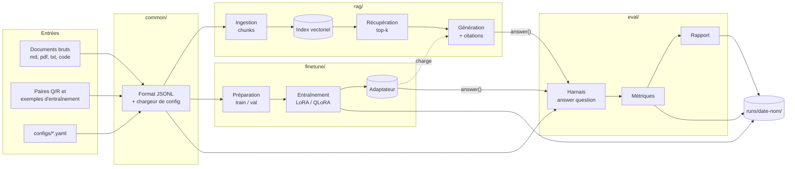
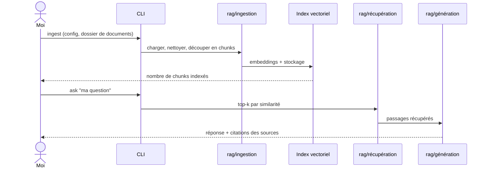
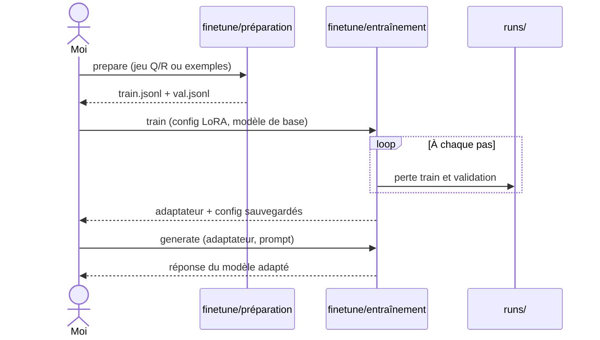
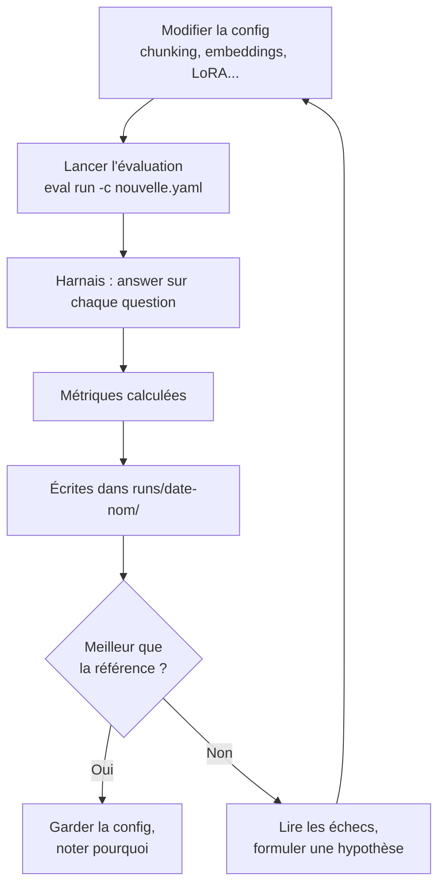
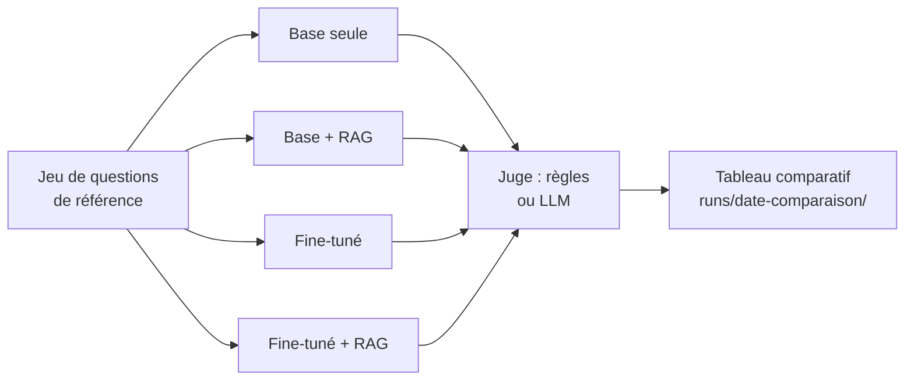
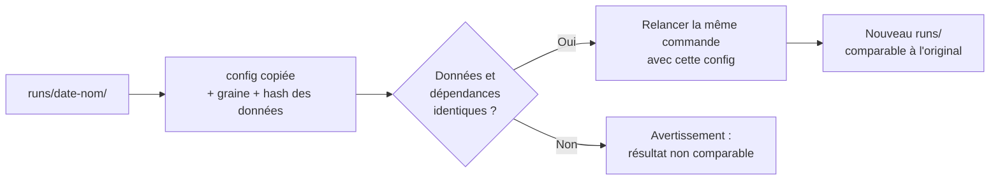

# APPFLOW — Labo IA : flux de données et parcours utilisateur

- **Statut :** Brouillon v0.1
- **Date :** 2026-10-09
- **Auteur :** Nicolas Lallier
- **Document lié :** [PRD](PRD.md)

Ce document décrit **comment les étapes s'enchaînent** : qui fait quoi, dans quel ordre, avec quelles entrées et sorties. Il n'y a pas d'écrans, puisque le PRD exclut l'interface web (CLI et notebooks seulement).

> **Noms de commandes provisoires.** Les commandes (`uv run rag ingest`, etc.) sont des hypothèses à confirmer en M0, comme les choix d'outils du PRD §3.

## 1. Vue d'ensemble : flux de données

Trois règles gouvernent le schéma :

- `rag/` et `finetune/` **ne s'appellent jamais entre eux**. Ils ne partagent que `common/`. Le seul lien est le chargement optionnel d'un adaptateur par la génération (système « fine-tuné + RAG »).
- `eval/` ne connaît qu'un contrat : `answer(question) -> {réponse, sources}`. Tout système qui le respecte peut être évalué.
- Tout ce qui est produit atterrit dans `runs/<date>-<nom>/`, jamais ailleurs.

## 2. Artefacts et conventions

| Artefact | Format | Produit par | Lu par | Versionné ? |
|---|---|---|---|---|
| Documents bruts | md, pdf, txt, code | Moi | `rag` (ingestion) | Non (`data/` ignoré) |
| Documents normalisés | JSONL | `rag` (ingestion) | `rag` (indexation) | Non |
| Jeu d'évaluation | JSONL (question, réponse attendue, sources) | Moi | `eval` | Non (exemples synthétiques seulement) |
| Données d'entraînement | JSONL train + val | `finetune` (préparation) | `finetune` (entraînement) | Non |
| Index vectoriel | Base embarquée | `rag` (indexation) | `rag` (récupération) | Non |
| Adaptateur LoRA + sa config | Poids + YAML | `finetune` (entraînement) | `finetune` (inférence), `rag` (variante fine-tuné + RAG) | Non |
| Configuration d'expérience | YAML | Moi | Tous | **Oui** (`configs/`) |
| Dossier d'exécution | `runs/<date>-<nom>/` : config copiée, métriques, sorties, version des données | Chaque commande | `eval` (rapport), moi | Non |

**Reproductibilité (U5).** Chaque dossier `runs/` contient la configuration complète utilisée, la graine, le hash du jeu de données et les versions verrouillées des dépendances (`uv.lock`). Rejouer = relancer la même config.

## 3. Parcours par cas d'usage

### 3.1 U1 — Indexer mes documents et les interroger (RAG)

| Étape | Commande (provisoire) | Entrées | Sorties |
|---|---|---|---|
| 1. Ingestion | `uv run rag ingest -c configs/rag.yaml` | Documents bruts, paramètres de chunking | JSONL normalisé |
| 2. Indexation | `uv run rag index -c configs/rag.yaml` | JSONL, modèle d'embedding | Index vectoriel |
| 3. Question | `uv run rag ask "..."` | Index, k, modèle de génération | Réponse citée sur la sortie standard |

**Variantes (F9).** Chunking, modèle d'embedding, k et modèle de génération se changent dans le YAML, sans toucher au code.

### 3.2 U2 — Fine-tuner un modèle

| Étape | Commande (provisoire) | Entrées | Sorties |
|---|---|---|---|
| 1. Préparation | `uv run finetune prepare -c configs/ft.yaml` | JSONL source | `train.jsonl`, `val.jsonl` |
| 2. Entraînement | `uv run finetune train -c configs/ft.yaml` | Données, modèle de base, hyperparamètres | Adaptateur, courbes de perte dans `runs/` |
| 3. Essai | `uv run finetune generate --adapter <chemin> "..."` | Adaptateur, avec ou sans fusion (F13) | Réponse du modèle |

### 3.3 U3 — Évaluer une variante

| Étape | Commande (provisoire) | Entrées | Sorties |
|---|---|---|---|
| 1. Évaluer | `uv run eval run -c configs/<variante>.yaml` | Config du système, jeu d'évaluation | `runs/<date>-<nom>/` avec métriques et réponses |
| 2. Comparer | `uv run eval diff runs/<a> runs/<b>` | Deux dossiers `runs/` | Tableau de différences de métriques |

Métriques de départ (PRD §5) : recall@k et fidélité pour le RAG, perte de validation et exactitude sur un test tenu à l'écart pour le fine-tuning.

### 3.4 U4 — Comparer les quatre systèmes

| Étape | Commande (provisoire) | Entrées | Sorties |
|---|---|---|---|
| Rapport | `uv run eval compare -c configs/compare.yaml` | Les 4 systèmes (déclarés dans la config), jeu de questions | Tableau d'exactitude par système, réponses détaillées |

Les quatre systèmes passent par le même contrat `answer()`. La config dit seulement lesquels activer et avec quel adaptateur ou quel index. C'est le critère de réussite de M3 : **une seule commande, un tableau reproductible**.

### 3.5 U5 — Rejouer une expérience

| Étape | Commande (provisoire) | Entrées | Sorties |
|---|---|---|---|
| Rejouer | `uv run eval replay runs/<date>-<nom>` | Dossier d'exécution | Nouveau dossier `runs/`, avec alerte si le hash des données ou `uv.lock` a changé |

## 4. Cas d'erreur et points de décision

| Situation | Détection | Action suivante |
|---|---|---|
| Mémoire insuffisante pendant l'entraînement | Crash ou swap massif | Réduire le batch, passer en QLoRA, ou prendre un modèle plus petit (1–3B). |
| Recall@k bas (la bonne source n'est pas dans le top-k) | Métrique RAG | Changer le chunking, le modèle d'embedding, augmenter k, puis tester recherche hybride et reranking (M4+). |
| Bon recall@k mais réponses fausses | Fidélité basse | Problème de génération : revoir le prompt ou le modèle de génération. |
| Perte de validation qui remonte | Courbes dans `runs/` | Surapprentissage : moins d'époques, plus de données, rang LoRA plus faible. |
| Le fine-tuné n'apprend pas les faits | Écart base / fine-tuné faible sur les faits | Attendu : le fine-tuning vise le style et la tâche, les faits relèvent du RAG (PRD §8). |
| LLM juge peu fiable | Désaccord avec ma relecture d'un échantillon | Compléter par des règles simples, relire à la main un échantillon fixe. |
| Hash des données différent au rejeu | Alerte de `eval replay` | Ne pas comparer ce run à l'original, ou régénérer les données à la version d'origine. |

## 5. Correspondance avec les jalons

| Jalon | Flux utilisables à la fin | Remarque |
|---|---|---|
| **M0 — Socle** | Une évaluation de bout en bout (3.3) sur un système trivial, et le rejeu (3.5) | Définit le contrat `answer()`, le format JSONL et la structure de `runs/`. |
| **M1 — RAG v1** | U1 (3.1), plus U3 (3.3) appliqué au RAG | Peut avancer en parallèle de M2. |
| **M2 — Fine-tuning v1** | U2 (3.2), plus U3 (3.3) appliqué au fine-tuning | Peut avancer en parallèle de M1. |
| **M3 — Comparaison** | U4 (3.4) | Nécessite M1 et M2. |
| **M4+ — Variantes** | Nouveaux systèmes branchés sur le même contrat `answer()` | Aucun flux existant ne change. |
